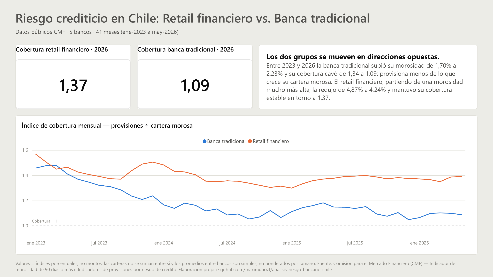
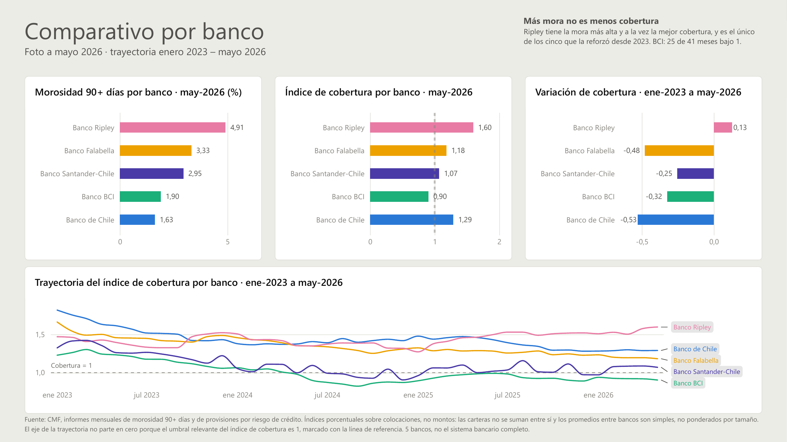
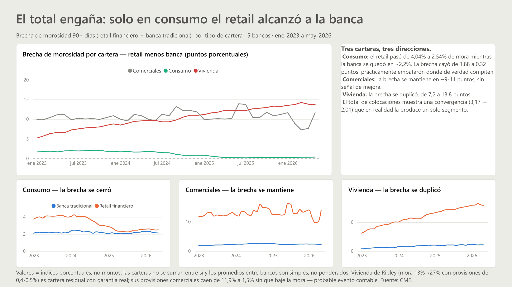

# Análisis comparativo de riesgo crediticio: retail financiero vs. banca tradicional en Chile

Análisis de la evolución del riesgo de crédito de cinco bancos chilenos entre enero 2023
y mayo 2026, construido sobre **datos públicos reales de la Comisión para el Mercado
Financiero (CMF)**, no sintéticos.

## Pregunta que responde

> ¿El riesgo crediticio del retail financiero se comporta distinto al de la banca
> tradicional, y esa diferencia se sostiene en el tiempo?

Se mide con tres indicadores mensuales por banco y por segmento de cartera:

| Indicador | Qué muestra |
|---|---|
| Morosidad 90+ días | Cuánta cartera ya se deterioró |
| Provisiones por riesgo de crédito | Cuánto anticipa el banco que va a perder |
| **Índice de cobertura** (provisiones / cartera morosa) | Cuán preparado está frente a lo que ya se deterioró |

El índice de cobertura es el KPI central: dos bancos con la misma morosidad pueden tener
posturas de riesgo completamente distintas según cuánto provisionen.

## Resultado principal

> **Los dos grupos se movieron en direcciones opuestas.** Entre enero de 2023 y mayo de
> 2026 la morosidad de la banca tradicional subió de 1,70% a 2,23% y su cobertura cayó de
> 1,34 a 1,09. En el mismo período el retail financiero **bajó** su morosidad de 4,87% a
> 4,24%, y su cobertura cedió solo 0,08 (1,45 → 1,37): un tercio de lo que perdió la banca,
> y estable en 1,37 desde 2024.
>
> La brecha entre ambos se cerró de **3,17 a 2,01 puntos porcentuales**, pero no porque el
> retail se pareciera a la banca: porque la banca se acercó al retail.

| | Banca tradicional | Retail financiero |
|---|---|---|
| Morosidad 90+ · 2023 → 2026 | 1,70% → **2,23%** | 4,87% → **4,24%** |
| Cobertura · 2023 → 2026 | 1,34 → **1,09** | 1,45 → **1,37** |

Todas las cifras de arriba son **promedios anuales**, y la brecha de 3,17 → 2,01 pp es esa misma
tabla restada — la misma base que usa el dashboard. Medida mes a mes la brecha cuenta lo mismo con
otros números: parte en 2,67 pp (ene-2023), llega a su **máximo de 3,46 pp en marzo de 2024** y
cierra en 1,96 pp (may-2026). Las dos bases conviven en el proyecto y cada cifra dice cuál usa,
porque un promedio anual y un mes puntual no son intercambiables.

La correlación entre las dos series mensuales de morosidad es **−0,19**: no es un ciclo de
crédito común empujando a los cinco bancos, son dos trayectorias distintas.

Y al bajar del grupo al banco aparece el corolario que rompe la intuición:

> **Más mora no es menos cobertura.** El banco más moroso de los cinco (Ripley, 4,91%) es a la
> vez el mejor cubierto (1,60) y el único que **reforzó** su cobertura desde 2023 (+0,13). El
> único que provisiona bajo su propia cartera morosa (BCI, cobertura 0,90) es de los que menos
> mora tienen (1,90%), y lleva 25 de 41 meses en esa posición.

Morosidad y cobertura no son dos formas de medir lo mismo: la primera describe la cartera, la
segunda describe la decisión del banco frente a esa cartera.

El desarrollo completo —siete hallazgos, con lo que los datos **no** permiten afirmar— está
en [`docs/hallazgos.md`](docs/hallazgos.md).

## El dashboard

Tres páginas en Power BI, cada una con **una** pregunta, no con quince métricas sueltas.

### 1 · Portada — ¿se mueven igual los dos grupos?



Dos tarjetas KPI con la cobertura 2026 de cada grupo y el gráfico protagonista: las dos
trayectorias de cobertura contra una línea de referencia en 1,0. El insight va **escrito** en la
página, no solo dibujado — quien la mira quince segundos tiene que salir con la conclusión, no
con la tarea de deducirla.

### 2 · Comparativo — ¿qué banco está más expuesto hoy?



Tres rankings del último mes publicado —morosidad, cobertura y **variación de cobertura desde
2023**— más la trayectoria completa de los 41 meses.

Los tres rankings comparten **el mismo orden de bancos** (morosidad descendente). En los dos que
no miden morosidad ese orden se logra agregando la medida de morosidad al pozo *Información sobre
herramientas* y ordenando por ella. Una versión anterior los ordenaba cada uno por su propia
métrica: el ojo creía comparar posiciones alineadas y estaba comparando ranking contra ranking.
**El orden de fila tiene que ser idéntico en los tres para que la comparación sea banco a banco.**

El tercer gráfico —barras divergentes de variación— es el único visual que prueba el titular de
la página con evidencia propia: cuatro bancos bajan su cobertura, uno la sube. Reemplazó a un
gráfico de "meses con cobertura < 1" que gastaba una tarjeta entera en dos barras; ese dato pasó
al cuadro de hallazgo, en texto.

**El eje Y de la trayectoria va de 0,8 a 1,9 y no parte en cero, a propósito.** El umbral
relevante del índice de cobertura es 1 —marcado con la línea de referencia—, no 0; partir en cero
aplastaría las cinco series contra el techo. Está declarado en la nota al pie de la página para
que nadie tenga que decidir si es un eje truncado a conveniencia.

El mes del ranking no está escrito a mano en ningún filtro: se deriva de los datos con
`MAX(fecha)`, así que al cargar junio el ranking se mueve solo.

### 3 · Segmentación — ¿en qué cartera se parecen?



Arriba, la **brecha** de morosidad —retail menos banca— de las tres carteras en un mismo eje. Es
el visual que sostiene el titular, porque compara *distancias*, y una distancia solo significa lo
mismo en las tres carteras si comparten escala. Abajo, la morosidad de cada grupo cartera por
cartera, en tres gráficos separados **con eje Y propio**.

La escala independiente de esos tres paneles es una decisión: los múltiplos pequeños de Power BI
fuerzan un eje común entre paneles, y con vivienda llegando a 16% y consumo sin pasar de 4%, la
escala compartida aplasta contra el piso justamente el panel donde está el hallazgo. Separarlos
deja ver la forma de cada cartera; la comparación de magnitudes ya quedó resuelta arriba. El costo
—que los tres paneles de abajo no se pueden comparar entre sí a ojo— está asumido, y por eso el
titular de la página no se apoya en ninguno de ellos. Ahí se ve que en comerciales y vivienda hay
un abismo entre retail y banca, y que **en consumo las dos líneas casi se tocan**.

Se muestran solo las carteras hoja (comerciales, consumo, vivienda). Los agregados quedan fuera:
un total junto a sus propias partes en el mismo eje invita a sumarlos, que es exactamente lo que
estos datos no permiten.

## Cómo se construyó

Un proceso **ETL** completo y reproducible de punta a punta. La descarga automatizada trae 82
archivos Excel desde el portal de la CMF —41 meses × 2 reportes— y la consolidación en Python
resuelve las trampas del origen: encabezados que cambian de posición entre meses, instituciones
que aparecen y desaparecen, y una fila oculta de códigos contables.

Sobre eso corre el control de **calidad de datos**: perfilamiento previo de cinco meses de
muestra, verificación de inventario antes de consolidar y validación de completitud del
resultado —2.460 filas, 0 duplicados, 41 meses continuos sin huecos—, además de siete chequeos
de integridad en la carga.

El **modelado de datos** es dimensional: dos dimensiones (banco y tiempo) y una tabla de hechos
en formato largo, con una restricción `UNIQUE` sobre el grano completo para que una recarga
falle en vez de duplicar en silencio. El análisis vive en SQL y en DAX, y las 28 cifras que se
ven en el dashboard se contrastan contra su dato de origen con un script, no a ojo.

## Alcance

**5 bancos**, elegidos para contrastar dos modelos de negocio:

| Banco | Grupo |
|---|---|
| Banco Falabella | Retail financiero |
| Banco Ripley | Retail financiero |
| Banco de Chile | Banca tradicional |
| Banco de Crédito e Inversiones — en el dashboard, *Banco BCI* | Banca tradicional |
| Banco Santander-Chile | Banca tradicional |

**Período:** enero 2023 – mayo 2026 (41 meses, frecuencia mensual).

El detalle está en [`docs/alcance.md`](docs/alcance.md). Lo que este análisis **no**
puede afirmar está en [`docs/limitaciones.md`](docs/limitaciones.md).

## Reproducibilidad

Los Excel crudos de la CMF **no se versionan**: son ~30 MB que cualquiera puede regenerar.
El `.gitignore` excluye los `.xlsx`, no las carpetas —los `.gitkeep` sí se versionan— para
que al clonar exista la estructura que `scripts/descargar_cmf.py` necesita. Ese script es
la pieza que hace este repositorio reproducible de punta a punta.

```bash
git clone https://github.com/maximunozf/analisis-riesgo-bancario-chile
cd analisis-riesgo-bancario-chile

python -m venv .venv
source .venv/bin/activate        # Windows: .venv\Scripts\activate
pip install -r requirements.txt

python scripts/descargar_cmf.py --dry-run   # muestra qué bajaría, sin descargar
python scripts/descargar_cmf.py             # descarga la serie completa (~10 min)
python scripts/verificar_inventario.py      # confirma que no hay meses faltantes
python scripts/consolidar_datos_cmf.py      # genera el CSV consolidado
```

Para levantar la base y correr el análisis:

```bash
cp .env.example .env                        # y editar con las credenciales de MySQL
mysql -u root -p < sql/create_tables.sql    # crea el esquema y la vista
python -u scripts/cargar_mysql.py           # carga las 2.460 filas
python -u scripts/cargar_mysql.py --validar # 7 chequeos de integridad

mysql -u root -p -t riesgo_bancario_cmf < sql/analisis_riesgo.sql
```

El script de carga es transaccional y la tabla de hechos tiene una restricción `UNIQUE`
sobre el grano completo: una segunda corrida falla en vez de duplicar en silencio. Para
recrear la base desde cero, `--recrear`.

`descargar_cmf.py` es **idempotente**: solo baja lo que falta, escribe a un archivo
temporal y lo renombra recién al terminar, de modo que una corrida interrumpida no deja
archivos parciales dados por buenos.

### Abrir el dashboard

**Sin instalar nada:** [`dashboard/dashboard_riesgo_cmf.pdf`](dashboard/dashboard_riesgo_cmf.pdf)
son las tres páginas exportadas, y las capturas de este README salen de ese mismo PDF.

`dashboard/Proyecto CMF.pbix` está en **modo Importar**, no DirectQuery: son 2.460 filas y el
archivo tiene que abrir aunque MySQL esté apagado. Para verlo no hace falta base de datos; para
**actualizarlo** sí:

- Conexión con un usuario de solo lectura, `pbi_lectura`, con `GRANT SELECT` únicamente sobre
  `riesgo_bancario_cmf`. Un informe no necesita permisos de escritura.
- En el diálogo de credenciales hay que usar la pestaña **Base de datos**, no *Windows*: MySQL no
  habla autenticación integrada de Windows.
- Requiere **MySQL Connector/NET 9.4.0**. Las versiones 9.5.0 y posteriores eliminaron el valor
  `SSL Mode=None` que el conector nativo de Power BI sigue enviando, y la conexión falla con
  `Requested value 'None' was not found`. Es un driver distinto de `mysql-connector-python`, el
  que usan los scripts de Python: desinstalar uno no afecta al otro.

## Estructura

```
├── data/raw/morosidad/      Excel originales CMF (no versionados, nunca se modifican)
├── data/raw/provisiones/    Excel originales CMF (no versionados, nunca se modifican)
├── data/processed/          CSV consolidado y limpio
├── scripts/                 descarga, verificación, consolidación, carga a MySQL
│                            y validación del dashboard
├── sql/                     create_tables.sql (esquema + vista) y analisis_riesgo.sql
├── dashboard/               Proyecto CMF.pbix, el tema versionado y el PDF exportado
└── docs/                    alcance, perfilamiento, limitaciones, modelo de datos,
                             hallazgos, validación y capturas
```

## Stack

Python (`pandas`, `requests`, `beautifulsoup4`, `openpyxl`) → MySQL → Power BI (DAX).

## Decisiones técnicas

**La descarga scrapea el índice en vez de construir URLs.** Cada mes se publica como un
artículo con ID impredecible (`w4-article-112237.html`), sin patrón derivable de la fecha.
Leer la página índice es la única forma reproducible de obtener los enlaces.

**Los índices de la CMF redirigen `/617/` → `/626/` (cadena 302 → 301) y sus enlaces son
relativos.** Resolverlos contra la URL solicitada en vez de la URL final produce rutas que
responden 404. La base del `urljoin` tiene que ser `resp.url`.

**El script ubica cada banco buscando su nombre, nunca por número de fila.** La cantidad de
filas de encabezado varía entre meses y la lista de instituciones no es estática (Banco
Security desaparece en noviembre 2025 por su fusión con Bice; Tanner Banco Digital aparece
ese mismo mes). Ver [`docs/perfilamiento.md`](docs/perfilamiento.md).

**El período cierra en el último mes con ambas fuentes publicadas.** Provisiones se publica
un mes después que morosidad, y el índice de cobertura exige las dos del mismo mes.

**Validación de integridad en la descarga.** Un `.xlsx` es un ZIP y siempre empieza con la
firma `PK`. El portal a veces devuelve páginas de error con HTTP 200; verificar los dos
primeros bytes las detecta antes de que contaminen el consolidado.

**La tabla de hechos está en formato largo, no una columna por indicador.** Agregar un
tercer indicador de la CMF es insertar filas, no alterar la tabla y reescribir la carga. El
costo —que la cobertura exige un self-join— se paga una sola vez en la vista
`vw_riesgo_ancho`. El razonamiento completo del modelo, con el diagrama ER, está en
[`docs/modelo_datos.md`](docs/modelo_datos.md).

**Los valores son índices porcentuales, no montos.** Los segmentos no se suman
(`comerciales + personas ≠ total`) y los promedios entre bancos son simples, no ponderados
por tamaño de cartera: ninguna de las dos fuentes publica saldos en pesos. Esta restricción
condiciona cómo se lee todo el análisis y está declarada en el dashboard, no solo en los
documentos.

**Toda medida DAX fija el segmento dentro del `CALCULATE`.** La vista trae los seis niveles de
cartera y un `AVERAGE` sin filtrar mezcla el total con sus propias partes: el retail daba 6,86%
en vez de 4,87% porque la vivienda de Ripley arrastraba el promedio. Es un error que **no da
ningún mensaje** — la cifra sale, y sale mal. La única excepción es la medida de la página 3,
donde el filtro se traslada de la medida al eje del visual.

**La cobertura se promedia, no se recalcula: `AVERAGE(indice_cobertura)`, no
`DIVIDE(provisiones, morosidad)`.** El índice ya viene calculado por banco-mes en la vista, y
promedio de razones ≠ razón de promedios. La segunda forma daba 1,32 donde el valor correcto es
1,34, y además rompía el contraste 1:1 contra el SQL.

**El calendario de Power BI se genera con DAX, no se importa `dim_tiempo`.** DAX exige que la
tabla marcada como *tabla de fechas* sea continua día por día, y `dim_tiempo` es mensual (41
filas). Dos tablas de fechas en el mismo modelo generan ambigüedad de filtros, así que la
mensual se excluye del modelo importado. Los límites del calendario se derivan de los datos con
`MIN`/`MAX`, nunca escritos a mano. La contrapartida —que esa definición deja de estar versionada
en SQL— está anotada en [`docs/modelo_datos.md`](docs/modelo_datos.md).

**El último mes de la serie se deriva del dato, no del calendario.** El calendario DAX es continuo
día por día y se extiende más allá de la última publicación de la CMF; ahí las medidas son
`BLANK`. Una medida que tome `MAX(dim_calendario[fecha])` como "último mes" compara contra un mes
vacío. La medida de variación de cobertura filtra primero los meses **con dato** y recién ahí toma
el mínimo y el máximo — espejo exacto del `MAX(id_tiempo)` del SQL:

```dax
VAR meses_con_dato =
    FILTER (
        CALCULATETABLE ( VALUES ( dim_calendario[fecha] ), REMOVEFILTERS ( dim_calendario ) ),
        NOT ISBLANK ( [Cobertura total colocaciones] )
    )
```

**Las medidas de Portada y Comparativo fijan el segmento; las de Segmentación no.** Es deliberado:
las dos primeras páginas comparan banco contra banco a nivel agregado, así que el segmento se fija
en `CALCULATE`. La tercera página *es* la comparación entre segmentos, así que el filtro se
traslada de la medida al eje del visual y se usa `KEEPFILTERS`. Una misma regla para las tres
páginas obligaría a duplicar medidas o a mostrar cifras mezcladas.

**Etiquetas en el idioma del negocio, modelo en la convención técnica.** En Power Query
`tipo_institucion` se renombra a *Banca tradicional* / *Retail financiero*; en MySQL el modelo
sigue en `snake_case`. El modelo mantiene la convención técnica, el dashboard habla el idioma de
quien lo lee.

**El nombre para mostrar de cada banco vive en `dim_banco`, no en Power Query.** BCI aparece
como *Banco BCI*: el nombre legal completo se truncaba a "Banco de Credito e Inversion…" en los
tres rankings de la página Comparativo, y BCI es como lo nombra el mercado. El cambio se hizo en
`scripts/cargar_mysql.py` —la columna `nombre_banco` está declarada en el DDL como *nombre para
mostrar en el dashboard*— y no con un *Reemplazar valores* en Power Query: así el rótulo se
recrea solo al cargar la base desde cero, en vez de existir únicamente dentro del `.pbix`.

**El estilo se aplica con un tema versionado, no formateando visual por visual.**
`dashboard/tema_riesgo_cmf.json` está en el repo y se importa desde *Ver → Temas → Buscar temas*.
La paleta se validó con un script de contraste y simulación de daltonismo: el **grupo** se codifica
por temperatura (frío = banca tradicional, cálido = retail) y el **banco** por matiz dentro de su
familia. Dos colores planos bastan en las barras, pero vuelven indistinguibles cinco series en un
gráfico de líneas; la codificación por familia resuelve las dos cosas con un solo criterio.

## Validación

Cada cifra visible en el dashboard se contrastó contra el dato del que sale. No es un detalle de
prolijidad: una medida DAX mal escrita o un filtro de visual de más producen un número plausible
y silenciosamente falso, **sin ningún mensaje de error**.

```bash
python scripts/validar_dashboard.py    # 44 cifras · sale con código 1 si alguna no cuadra
```

| Cifra en pantalla | Base | Cuántos valores | Resultado |
|---|---|---|---|
| Cobertura 2026 · retail / banca (Portada) | promedio anual | 2 | ✅ 1,37 / 1,09 |
| Ranking may-2026 · mora, cobertura y variación (Comparativo) | último mes | 15 | ✅ uno a uno |
| Cifras escritas a mano en el cuadro de hallazgo (Comparativo) | serie completa | 4 | ✅ |
| Brechas por cartera y morosidad en consumo (Segmentación) | último mes y anual | 7 | ✅ |
| Cuadro de texto de la Portada (mora y cobertura por grupo) | promedio anual | 8 | ✅ |
| Cuadro de texto de Segmentación (brechas por cartera y del total) | promedio anual | 8 | ✅ |

La columna **Base** no es decorativa: los rankings muestran el último mes publicado y los cuadros
de texto citan promedios anuales. La brecha de consumo es 0,36 pp en may-2026 y 0,32 pp en promedio
2026 — las dos ciertas, y confundirlas hace ver un defecto donde no lo hay. Cada cifra validada
declara con qué base se comparó.

Esa validación encontró **tres defectos que en pantalla se veían bien**: una medida de variación
que devolvía el valor inicial con signo negativo, un promedio de cobertura calculado como razón
de promedios, y medidas sin filtro de segmento que mezclaban el total con sus propias partes. Los
tres están explicados en [`docs/validacion.md`](docs/validacion.md), junto con el criterio de por
qué unas cifras se comparan a mano y otras por script.

Una segunda pasada, esta vez sobre el control mismo, encontró un cuarto: las **16 cifras escritas
a mano en los cuadros de texto** de la Portada y de Segmentación quedaban fuera del script, y
estaban en promedio anual mientras el validador comparaba contra el último mes. Un texto
interpretativo envejece igual que una medida —se edita a mano y nadie lo recalcula—, así que ahora
también entra al control: las 44 cifras se recalculan desde el CSV, cada una contra su propia base.

## Fuentes

- [Indicador de morosidad de 90 días o más — CMF](https://www.cmfchile.cl/portal/estadisticas/617/w3-propertyvalue-28914.html)
- [Indicadores de Provisiones por Riesgo de Crédito de Bancos — CMF](https://www.cmfchile.cl/portal/estadisticas/617/w3-propertyvalue-29554.html)

## Licencia

MIT — ver [`LICENSE`](LICENSE). Los datos son de dominio público y pertenecen a la CMF.

## Autor

**Maximiliano Muñoz** — Analista Programador (INACAP), estudiante de Ingeniería Informática.

- LinkedIn: [maximiliano-munoz-fuentes](https://www.linkedin.com/in/maximiliano-munoz-fuentes)
- Portafolio: [Notion](https://atlantic-message-83c.notion.site/Maximiliano-Mu-oz-39df3c321fea807888aefa80ece9e316)
- Otro proyecto: [portfolio-retail-financiero](https://github.com/maximunozf/portfolio-retail-financiero) — modelo relacional MySQL + dashboard Power BI
