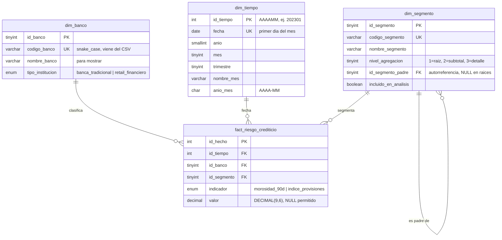
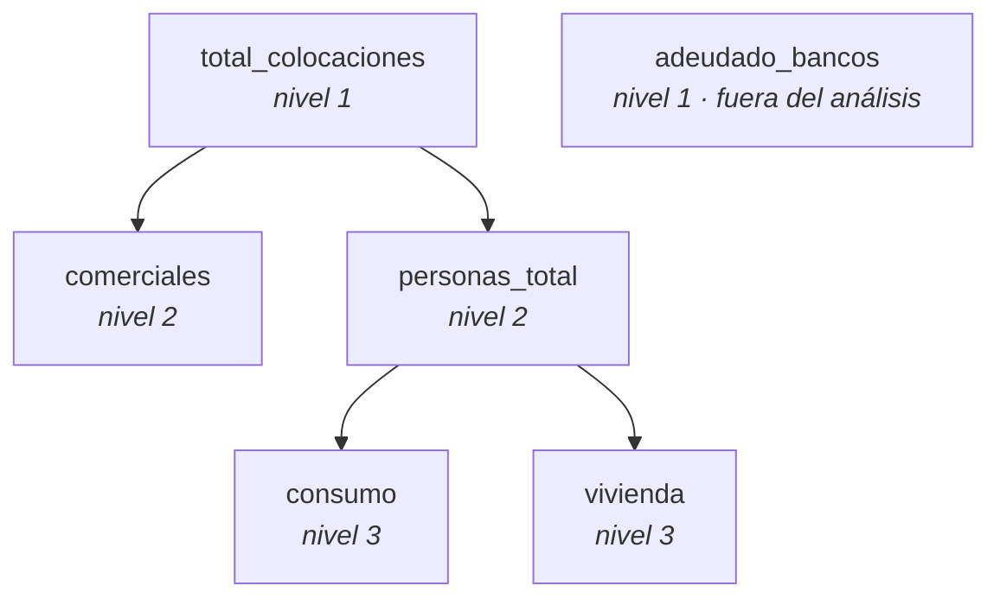

# Modelo de datos

Base: `riesgo_bancario_cmf` · MySQL 8.0 · InnoDB · utf8mb4
DDL: [`sql/create_tables.sql`](../sql/create_tables.sql) · Carga: [`scripts/cargar_mysql.py`](../scripts/cargar_mysql.py)

Esquema en estrella con tres dimensiones y una tabla de hechos en formato largo.
El grano de la tabla de hechos es **un banco, un mes, un segmento, un indicador**:

`5 bancos × 41 meses × 6 segmentos × 2 indicadores = 2.460 filas`

---

## Diagrama entidad-relación



### Jerarquía de segmentos



---

## Decisiones de diseño

| Decisión | Alternativa descartada | Por qué |
|---|---|---|
| Tabla de hechos en **formato largo** | Una columna por indicador | Agregar un tercer indicador de la CMF es insertar filas, no alterar la tabla ni reescribir la carga. El costo —un *self-join* para la cobertura— se paga una sola vez, en la vista `vw_riesgo_ancho`. |
| `indicador` como **dimensión degenerada** (texto en la fact) | `dim_indicador` | Son dos valores fijos sin atributos propios que describir. Una dimensión de dos filas y cero atributos agrega un join a cada consulta sin agregar información. |
| `dim_segmento` **sí** como tabla | Segmento como texto en la fact | Los segmentos no están al mismo nivel. Sin `nivel_agregacion` declarado en algún lugar, un gráfico con los 6 segmentos lado a lado muestra totales junto a sus propias partes. |
| `id_segmento_padre` **autorreferente** | Jerarquía escrita en un comentario | La jerarquía queda declarada *en los datos* y consultable con un join, en vez de depender de que alguien lea la documentación. |
| `id_tiempo` = **AAAAMM** | `AUTO_INCREMENT` | Estable entre recargas, legible al depurar y ordenable sin join. Deja de ser una clave opaca, pero en un calendario mensual de 41 filas el beneficio práctico gana. |
| `dim_tiempo` **continua** por rango | Solo los meses presentes en el CSV | Un calendario con huecos rompe la inteligencia de tiempo en DAX y hace que un mes ausente se dibuje como un mes en cero. |
| `valor` como **DECIMAL(9,6)** | `FLOAT` / `DOUBLE` | Son indicadores financieros. `DOUBLE` es binario y arrastra error de representación: dos corridas del mismo `SUM()` pueden diferir en el último decimal. |
| `valor` **admite NULL** | Guardar 0 | La CMF publica `---` cuando un banco no opera un segmento. `0%` de morosidad y "no participa" no son lo mismo, y el 0 contaminaría cualquier promedio. |
| `UNIQUE` sobre el grano completo | Solo la PK autoincremental | Si la carga se corre dos veces sin limpiar, o un Excel trae un banco repetido, el `INSERT` falla en vez de duplicar en silencio. |
| **Cargar los 6 segmentos**, incluido `adeudado_bancos` | Filtrarlo en la carga | La base espeja el CSV completo. La exclusión vive en las consultas y en `incluido_en_analisis`: es una decisión visible y auditable, no un dato desaparecido. |

---

## Advertencias de uso

**Los valores son índices porcentuales, no montos.** Esta es la trampa principal del
dataset y condiciona toda consulta que se escriba encima:

- **No se pueden sumar los segmentos.** `comerciales + personas_total` no da
  `total_colocaciones`. Reconstruir el total exigiría los saldos en pesos, que estos dos
  reportes de la CMF no entregan. La jerarquía de `dim_segmento` sirve para **filtrar y
  agrupar**, nunca para agregar.
- **Los promedios entre bancos son simples, no ponderados.** `AVG(morosidad_90d)` sobre
  los tres bancos tradicionales le da el mismo peso a Banco de Chile que a cualquier otro,
  sin importar el tamaño de su cartera. No es la morosidad del grupo: es el promedio de
  las morosidades de sus miembros. Todas las cifras comparativas del proyecto se calculan
  así y se reportan como tales.
- **`adeudado_bancos` está fuera del análisis.** Constante `0,00` en morosidad para los
  tres bancos tradicionales y `NULL` para los dos de retail. Se carga, se marca
  `incluido_en_analisis = FALSE` y se excluye de consultas y dashboard.
- **La cobertura es una razón aproximada.** Numerador y denominador vienen de reportes
  distintos, con denominadores contables que el marco de la CMF trata como equivalentes
  pero que no se verificaron contra saldos. Ver `docs/limitaciones.md`.

---

## Vista `vw_riesgo_ancho`

El *self-join* que cobra el formato largo, resuelto una vez. Devuelve una fila por
banco × mes × segmento con los dos indicadores en columnas y `indice_cobertura`
ya calculado. Es la vista que consume Power BI y sobre la que se escriben los
análisis de los Días 6-8.

```sql
SELECT anio, tipo_institucion,
       ROUND(AVG(morosidad_90d), 2)      AS morosidad_prom,
       ROUND(AVG(indice_provisiones), 2) AS provisiones_prom,
       ROUND(AVG(indice_cobertura), 2)   AS cobertura_prom
FROM vw_riesgo_ancho
WHERE codigo_segmento = 'total_colocaciones'
GROUP BY anio, tipo_institucion
ORDER BY anio, tipo_institucion;
```

| anio | tipo_institucion | morosidad_prom | provisiones_prom | cobertura_prom |
|---|---|---|---|---|
| 2023 | banca_tradicional | 1,70 | 2,24 | 1,34 |
| 2023 | retail_financiero | 4,87 | 7,01 | 1,45 |
| 2024 | banca_tradicional | 2,14 | 2,29 | 1,12 |
| 2024 | retail_financiero | 5,21 | 7,17 | 1,37 |
| 2025 | banca_tradicional | 2,18 | 2,37 | 1,13 |
| 2025 | retail_financiero | 4,34 | 6,02 | 1,37 |
| 2026 | banca_tradicional | 2,23 | 2,40 | 1,09 |
| 2026 | retail_financiero | 4,24 | 5,97 | 1,37 |

Estas cifras coinciden hasta el segundo decimal con el análisis exploratorio hecho en
pandas sobre el CSV, antes de existir la base. Es la validación cruzada del modelo: dos
caminos independientes, el mismo resultado.

---

## Cómo reproducir la base

```bash
cp .env.example .env          # y completar MYSQL_USER / MYSQL_PASSWORD
pip install -r requirements.txt
python -u scripts/cargar_mysql.py --recrear
```

El script ejecuta el DDL, puebla las tres dimensiones, carga los hechos y valida el
resultado antes de hacer commit. Si algún chequeo falla, aplica `ROLLBACK` y la base
queda sin cambios: es preferible una base vacía a una base a medio cargar que alguien
consulte creyendo que está completa.

### Validación de la carga

| Chequeo | Resultado |
|---|---|
| Filas en la tabla de hechos | 2.460 / 2.460 |
| Nulos estructurales | 164 / 164 |
| Nulos fuera de `adeudado_bancos` | 0 |
| Meses en el calendario | 41 |
| Filas por indicador | 1.230 y 1.230 |
| Rango de valores | 0,000000 a 28,237935 |
| Suma de valores, base vs. CSV | 8.465,7966 = 8.465,7966 |

El último chequeo es el más fuerte: compara la suma de todos los valores en la base
contra la del CSV de origen. Detecta filas perdidas, duplicadas o truncadas por el
`DECIMAL(9,6)`, cosas que un simple `COUNT(*)` correcto no descartaría.

---

## El calendario en Power BI: por qué hay dos y no uno

`dim_tiempo` es **mensual**: 41 filas, una por mes, con la fecha del primer día. Ese es el
grano real de la fuente —la CMF publica una vez al mes— y en el modelo relacional cumple
dos funciones que ninguna tabla generada al vuelo puede cumplir: es el destino de una clave
foránea desde la tabla de hechos, y garantiza que no existan meses sin fila.

Power BI, en cambio, exige que la tabla que se marca como *tabla de fechas* tenga una
**columna de fechas continua día por día**. Con un calendario mensual la validación falla
con "la columna de fecha no puede tener intervalos vacíos". No es un defecto del modelo: es
un requisito del motor de inteligencia de tiempo de DAX, que necesita poder recorrer días
para resolver `DATEADD`, `SAMEPERIODLASTYEAR` o `DATESYTD`.

**Decisión:** el calendario diario se genera **dentro de Power BI** con DAX y `dim_tiempo`
se excluye del modelo importado.

```dax
dim_calendario =
VAR fecha_min = MIN( vw_riesgo_ancho[fecha] )
VAR fecha_max = EOMONTH( MAX( vw_riesgo_ancho[fecha] ), 0 )
RETURN
SELECTCOLUMNS(
    CALENDAR( fecha_min, fecha_max ),
    "fecha",      [Date],
    "anio",       YEAR( [Date] ),
    "mes",        MONTH( [Date] ),
    "nombre_mes", FORMAT( [Date], "mmmm" ),
    "anio_mes",   FORMAT( [Date], "yyyy-MM" ),
    "trimestre",  "T" & QUARTER( [Date] )
)
```

Relación: `dim_calendario[fecha]` → `vw_riesgo_ancho[fecha]`, uno a muchos. Solo 41 de las
~1.250 fechas del calendario tienen hechos asociados; el resto existe únicamente para que
la serie sea continua.

Tres detalles deliberados:

- **Los límites se derivan de los datos, no se escriben a mano.** `MIN`/`MAX` sobre la
  vista más `EOMONTH` para cerrar en el último día del mes final. Si mañana se agregan los
  meses de junio 2026 en adelante, el calendario se extiende solo. Una fecha literal en el
  código sería una bomba de tiempo.
- **`anio_mes` en formato `yyyy-MM`** ordena alfabéticamente igual que cronológicamente, así
  que no necesita una columna de ordenamiento auxiliar.
- **`dim_tiempo` no se importa a Power BI.** Dos tablas de fechas en un mismo modelo generan
  ambigüedad de filtros y confunden a quien lo abra. Su rol —integridad referencial y
  calendario sin huecos— pertenece a MySQL, no al informe.

La contrapartida honesta de esta decisión es que la definición del calendario deja de estar
versionada en SQL y pasa a vivir dentro del `.pbix`. Por eso el código DAX queda escrito
aquí: quien clone el repositorio puede reconstruirlo sin abrir el archivo binario.
